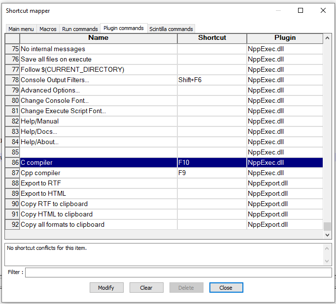

# Hướng dẫn cài trình biên dịch C vào phần mềm Notepad++

## Bước 1: Cài đặt Notepad++

## Bước 2: Cài đặt trình biên dịch MinGW 

Link tải: https://sourceforge.net/projects/mingw/

Chọn đường dẫn lưu folder cài đặt, nên sử dụng C:\MinGW

✅ CÁC GÓI CẦN CÀI:
Trong tab Basic Setup, hãy tick chọn ít nhất các mục sau:

✅ mingw32-base

Đây là gói bắt buộc, chứa trình biên dịch gcc (cho C), g++ (cho C++), và các công cụ cơ bản khác.

✅ mingw32-gcc-g++

Bao gồm cả trình biên dịch C++ (g++). Nhiều IDE cần gói này kể cả khi bạn chỉ viết C.

⚙️ CÁCH CÀI:

Tick chọn các ô như hình:

mingw32-base

mingw32-gcc-g++

Vào menu Installation → Apply Changes

Bấm Apply để MinGW tự động tải và cài đặt các gói đã chọn.

## Bước 3: Thêm Environment Variables cho MinGW

Mở Windown Search tìm kiếm `Edit the system environment variables` nhấn enter

Trong hộp User variables for ... --> Chọn Path (nếu chưa có thi tạo mới), nhấn edit 

Thêm 1 dòng: `C:\MinGW\bin` --> OK để thoát việc tạo môi trường.

Mở Command Promt lên (Win + R) gõ cmd Enter, trong bảng Command gõ gcc –-version ENTER

## Bước 4: Cài MinGW vào Notepad++

Mở Notepad++ lên, click vào Plugins > Plugin Admin...

Ở tab Available, tìm NppExec vào click Install để cài đặt

Plugins > NppExec > Execute NppExec Scriptđể cài script (hoặc sử dụng phím tắt F6 để mở)

Nhập script bên dưới vào, đặt tên cho script và click SAVE để lưu lại đặt tên là C compiler

```script
NPP_SAVE
CD $(CURRENT_DIRECTORY)
set LEN ~ strrfind $(FILE_NAME) .
set EXENAME ~ substr 0 $(LEN) $(FILE_NAME)
set $(EXENAME) = $(EXENAME).exe
C:\MinGW\bin\gcc.exe -Wall "$(FILE_NAME)" -o "$(EXENAME)"

IF $(EXITCODE) == 0 THEN
    size "$(EXENAME)"
    npp_run cmd /c "$(EXENAME)" & pause
ENDIF
```

Tương tự với script cho C++ compiler

```script
NPP_SAVE
CD $(CURRENT_DIRECTORY)
set LEN ~ strrfind $(FILE_NAME) .
set EXENAME ~ substr 0 $(LEN) $(FILE_NAME)
set $(EXENAME) = $(EXENAME).exe
C:\MinGW\bin\g++.exe -Wall "$(FILE_NAME)" -o "$(EXENAME)"

IF $(EXITCODE) == 0 THEN
    size "$(EXENAME)"
    npp_run cmd /c "$(EXENAME)" & pause
ENDIF
```

Bây giờ bạn chọn đúng script với source code của mình và nhấn OK để kiểm tra thử.

## Bước 5: Tạo phím tắt cho Compiler

Vào Plugins > NppExec > Advanced Options.

Ở phần Menu Items, đặt tên và chọn các compiler tương ứng vào bên dưới sau đó click Add/Modify, click OK để hoàn tất!

Tiếp theo vào Setting > Shortcut Mapper, chọn tab Plugin Commands.

Tìm đến compiler của bạn nhấn đúp hoặc chọn nó rồi click Modify.



Chọn phím tắt theo thói quen và sở thích rồi click OK.
