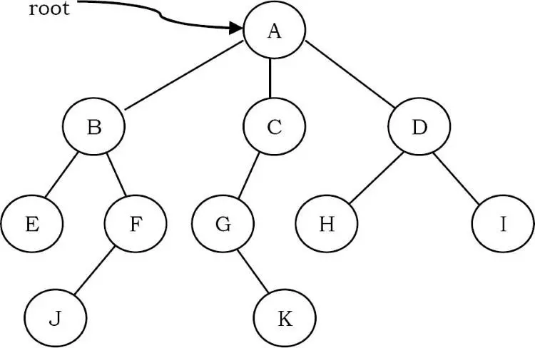
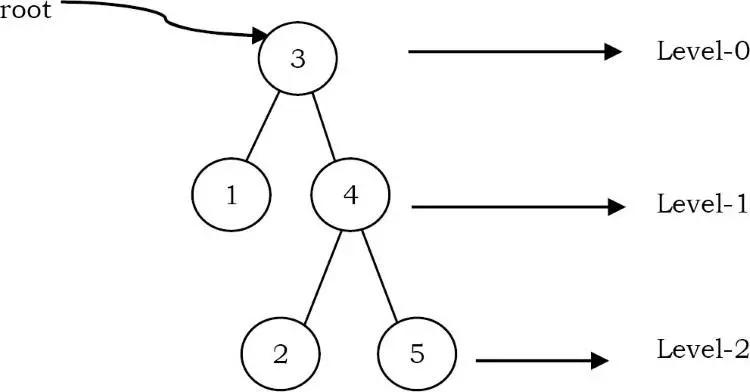
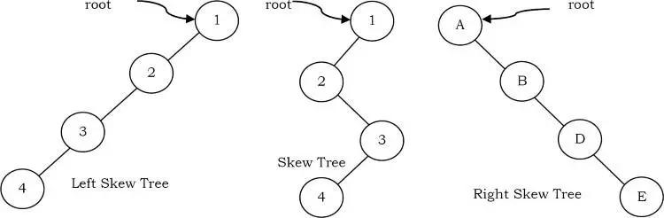

# Tree

## 1. Lý thuyết về cây nhị phân

Tree là một cấu trúc dữ liệu tương tự như một linked list nhưng thay vì mỗi node chỉ đơn giản chỉ đến node tiếp theo theo kiểu tuyến tính, ở tree mỗi node trỏ đến một số node khác. Tree là một ví dụ về cấu trúc dữ liệu phi tuyến. Cấu trúc cây là một cách thể hiện bản chất thứ bậc của cấu trúc dưới dạng đồ họa.

## 2. Các thuật ngữ sử dụng trong cấu trúc Cây

- Root: Node tổ tiên của cây. Là Node mà không có cha
- Child: Là Node con của một Node cụ thể nào đó
- Parent: Ngược lại của Child
- Siblings: Các Node có cùng một cha
- Descendant: Node có thể truy cập bằng cách duyệt từ cha tới con
- Ancestor: Node có thể truy cập bằng cách duyệt từ con đến cha
- Leaf: Node không có Child
- Internal node: Node có ít nhất 1 Child
- External node: Node không có Child

- Một edge(cạnh) đề cập đến liên kết từ cha đến con (tất cả các liên kết trong hình).
- Root của cây là node không có bố mẹ. Có thể có nhiều nhất một node gốc trong một cây (node A trong ví dụ trên).
- Một edge(cạnh) đề cập đến liên kết từ cha đến con (tất cả các liên kết trong hình).
- Một node không có node con được gọi là leaf node (E, J, K, H và I).
- Những node con có cùng node cha được gọi là siblings(anh chị em ruột - B, C, D là siblings của A và E, F là anh chị em của B).
- Một node p là ancestor(tổ tiên) của node q nếu tồn tại một đường đi từ gốc đến q và p xuất hiện trên đường đi. Node q được gọi là descendant(con cháu) của p. Ví dụ, A, C và G là tổ tiên của K.
- Tập hợp tất cả các node ở một độ sâu nhất định được gọi là level của cây (B, C và D là cùng một mức). Nút Root ở mức không.
- Độ sâu của node là độ dài của đường đi từ gốc đến node (độ sâu của G là 2, A - C - G).
- Chiều cao của một node là độ dài của đường đi từ nút đó đến nút sâu nhất. Chiều cao của cây là chiều dài của đường đi từ root đến node sâu nhất trong cây. Một cây chỉ có một node (gốc) có chiều cao bằng không. Trong ví dụ trước, chiều cao của B là 2 (B - F - J).
- Chiều cao của cây là chiều cao lớn nhất trong số tất cả các nút trong cây và chiều sâu của cây là chiều sâu lớn nhất trong số tất cả các nút trong cây. Đối với một cây nhất định, chiều sâu và chiều cao trả về cùng một giá trị. Nhưng đối với các node riêng lẻ, chúng ta có thể nhận được các kết quả khác nhau.

- Kích thước của một node là số lượng nút con mà nó có bao gồm cả chính nó (kích thước của cây con C là 3).
- Nếu mọi node trong cây chỉ có một node con (trừ các nút lá) thì ta gọi các cây như vậy là cây xiên(skew trees). Nếu mọi node chỉ có con trái thì chúng ta gọi chúng là cây xiên trái(left skew trees). Tương tự, nếu mọi node chỉ có con bên phải thì chúng ta gọi chúng là cây xiên bên phải(right skew trees).

## 3. Binary Trees

Một cây được gọi là cây nhị phân(binary tree) nếu mỗi nút không có con nào, một con hoặc hai con. Cây rỗng cũng là một cây nhị phân hợp lệ. Chúng ta có thể hình dung cây nhị phân bao gồm một gốc và hai cây nhị phân rời rạc, được gọi là cây con trái và phải của gốc.

Cây nhị phân là một cấu trúc bao gồm các Node, trong đó mỗi Node bao gồm 3 thành phần sau:

- Data element: Lưu giữ giá trị 1 phần tử với kiểu dữ liệu bất kỳ
- Left pointer: Con trỏ trỏ tới cây nhị phân bên trái của Node
- Right pointer: Con trỏ trỏ tới cây nhị phân bên phải của Node

## 4. Cây tìm kiếm nhị phân(TA: Binary Search Tree – viết tắt: BST) – là một cây nhị phân và có thêm các ràng buộc sau đây:

- Giá trị của tất cả các Node ở cây con bên trái phải <= giá trị của Node gốc.
- Giá trị của tất cả các Node ở cây con bên phải phải > giá trị của Node gốc.
- Tất cả các cây con(bao gồm bên trái và phải) cũng đều phải đảm bảo 2 tính chất trên.

Cây tìm kiếm nhị phân là một cấu trúc dữ liệu hiệu quả cho phép chúng ta xây dựng nên một danh sách mà dữ liệu trên đó được sắp xếp:

Nó được gọi là cây nhị phân vì mỗi Node của cây chỉ có tối đa hai con
Nó được gọi là cây tìm kiếm nhị phân vì nó có thể được sử dụng để tìm kiếm sự hiện diện của một phần tử trong thời gian O(log (n)).

### 1. Xóa Node trong BST

1. Lấy giá trị con trái nhất
Rất đơi giản, duyệt theo con trỏ trỏ đến cây con bên trái tới chừng nào không còn con bên trái nữa thì đó là con trái nhất rồi.

Hàm này sẽ được chúng ta sử dụng trong việc xóa một Node có giá trị chỉ định trên BST ở mục tiếp theo

Việc xóa Node trong BST có lẽ là phức tạp nhất trong các chức năng của cây tìm kiếm nhị phân. Nếu Node bạn cần xóa là Node lá thì việc xóa rất đơn giản. Cái khó ở chỗ xóa một Node ở trung gian, khi đó, bạn phải tìm cách xóa và nối lại mà vẫn đảm bảo cây mới vẫn là BST. Chúng ta sẽ xem xét từng trường hợp trước khi code nhé:

2. Node cần xóa là Node lá(không có child nào cả)
Giả sử ta cần xóa 20 trong hình dưới đây, đơn giản là chỉ cần giải phóng ô nhớ đó.

              50                            50
           /              delete(20)      /   
          30      70       --------->    30     70 
         /      /                           /   
       20   40  60   80                   40  60   80
3. Node cần xóa có 1 child
Trong trường hợp này, Node bị xóa sẽ được giải phóng và cây con duy nhất của Node bị xóa sẽ được liên kết trực tiếp với cha của Node bị xóa.

              50                            50
           /              delete(30)      /   
          30      70       --------->    40     70 
                /                            /   
            40  60   80                       60   80
4. Node cần xóa có đủ 2 child
- Xóa node có 2 con trong BST
- Giả sử cần xóa Node khoanh đỏ. Khi đó, ta cần tìm Node thế thân cho Node đỏ này, đó là Node LeftMostChild của cây con bên phải của Node đỏ(72) = Node khoanh màu xanh(54) . Sau đó, gọi đệ quy Xóa Node màu xanh. Khi đó Node cần xóa sẽ quay trở về trường hợp 1 hoặc 2(Trong ảnh này là trường hợp 2 – có 1 child).
- Đây là trường hợp nan giải nhất, nhưng chúng ta vẫn có cách làm như sau:
- 
- Tìm Node của con trái nhất(giả sử nó là leftmost) của cây con bên phải của Node cần xóa.
- Cập nhật giá trị của Node cần xóa = giá trị của Node leftmost.
- Gọi đệ quy hàm Delete xóa Node leftmost khỏi BST.
- Giải thích:

Khi muốn xóa Node có 2 con, ta cần tìm Node nào đó trong BST thỏa mãn tính chất lớn hơn lớn hơn tất cả các con bên trái và nhỏ hơn tất cả các con bên phái -> Node đó chính là LeftMostChild của con bên phải của Node cần xóa.
Ta chỉ cần sửa giá trị của Node cần xóa, không cần xóa Node đó làm gì. Thay vào đó, xóa Node bị thế thân(LeftMostChild của con bên phải của Node cần xóa).

### 2. Tìm kiếm trên BST
Việc tìm kiếm cũng tương tự như việc thêm phần tử vào BST. Ta có quy trình như sau:

- Nếu Node hiện tại có giá trị = giá trị cần tìm, trả về true và kết thúc.
- Nếu Node hiện tại có giá trị > giá trị cần tìm, gọi đệ quy tìm ở cây con bên trái.
- Nếu Node hiện tại có giá trị < giá trị cần tìm, gọi đệ quy tìm ở cây con bên phải
- Nếu tìm đến hết cây(Node đó = NULL) mà không xảy ra (1), trả về false và kết thúc.

Duyệt cây tìm kiếm nhị phân

Ở mục này mình sẽ trình bày về 3 cách duyệt cây tìm kiếm nhị phân. Chúng ta sẽ đi vào chi tiết từng cách nhé. Thứ tự duyệt được đặt tên phụ thuộc vào vị trí của Node root trong quá trình duyệt:

- PreOrder: Node -> Left -> Right
- InOrder: Left -> Node -> Right
- PostOrder: Left -> Right -> Node
- Thực ra 3 phần tử Left, Right, Node có tất cả 6 hoán vị cơ. Còn 3 cái nữa các bạn tự cài nhé.